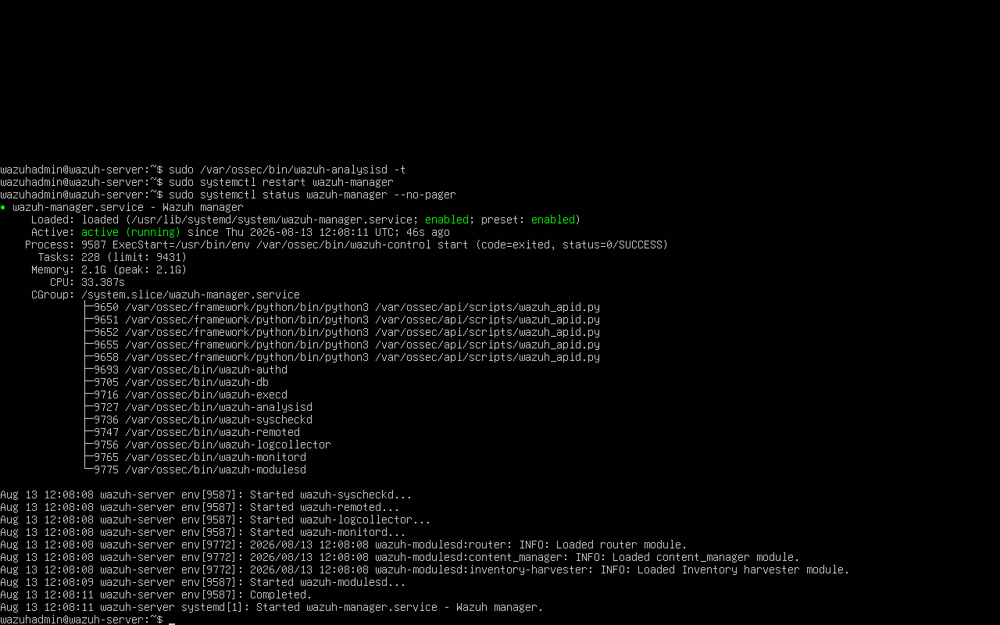
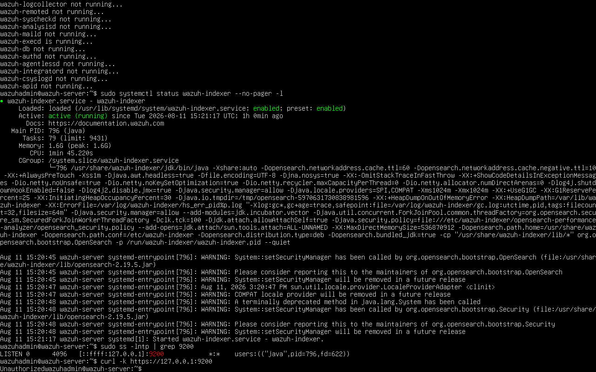
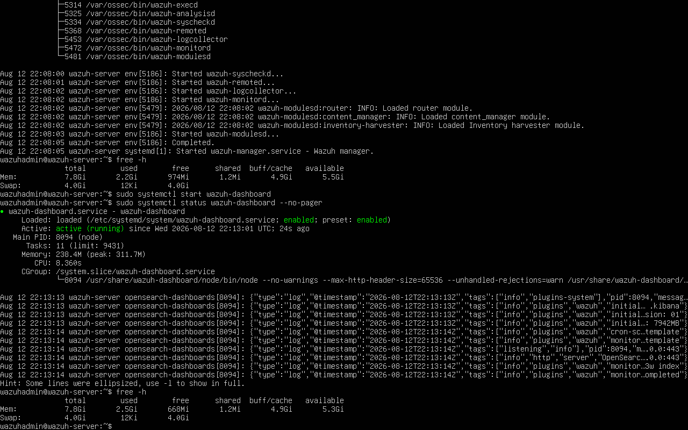
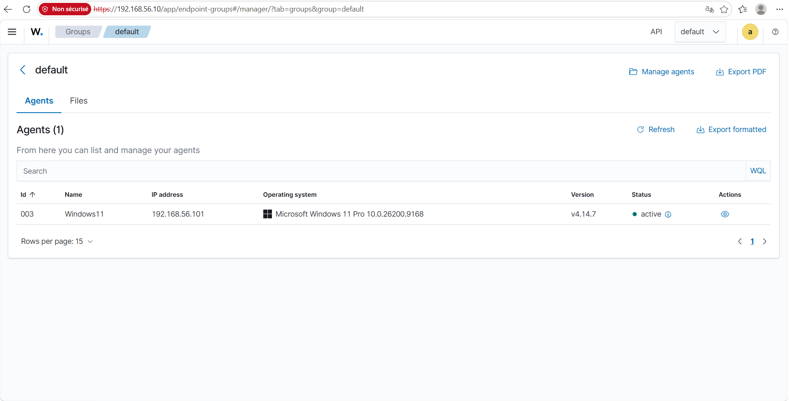
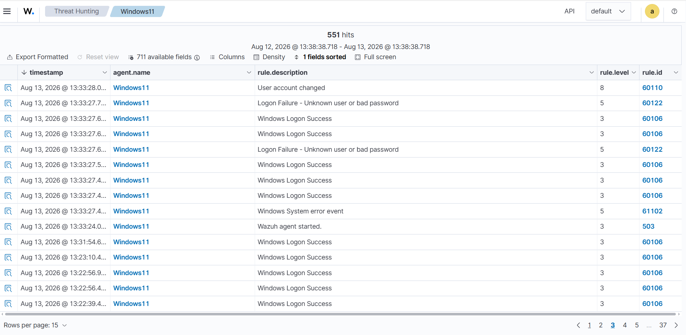
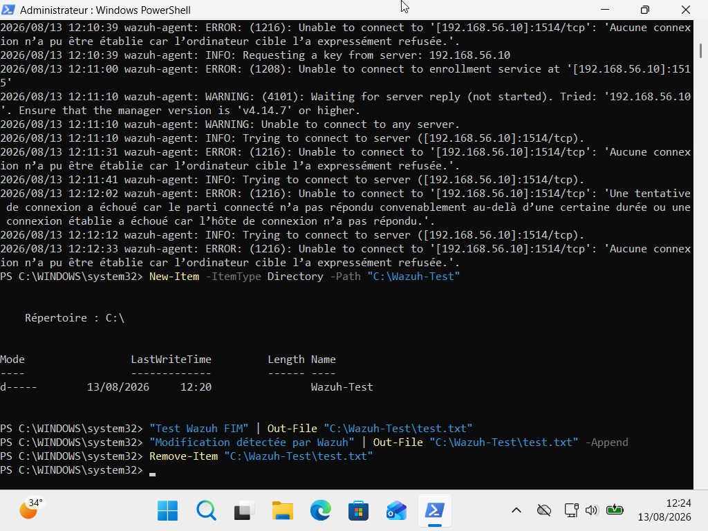
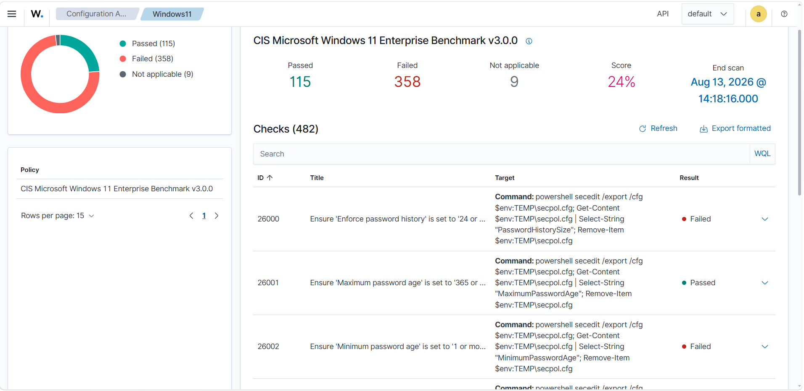
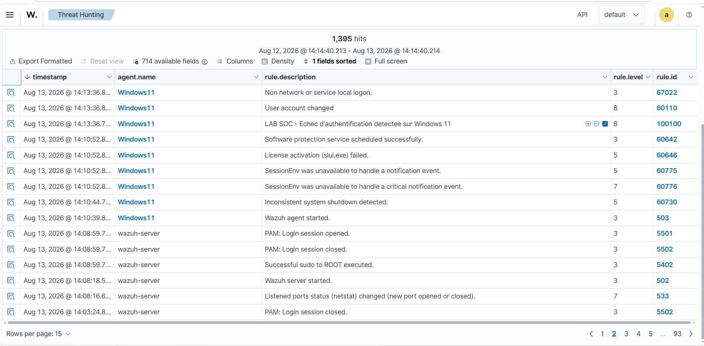
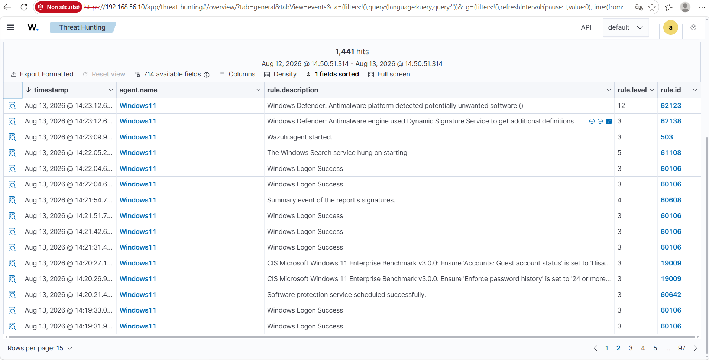
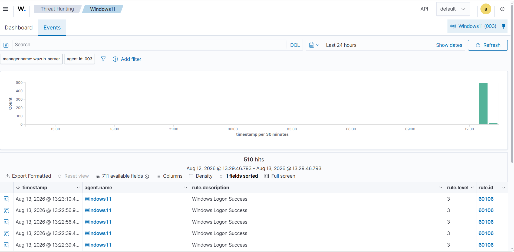

# wazuh-soc-lab
Wazuh SOC / SIEM Home Lab — Déploiement d'un SIEM Wazuh supervisant un endpoint Windows 11 : collecte et analyse des logs, FIM, SCA/CIS Benchmark, Microsoft Defender, Threat Hunting et développement de règles de détection personnalisées.
# 🛡️ Wazuh SIEM – Laboratoire SOC de supervision Windows 11

## 📌 Présentation

Ce projet consiste à mettre en place un environnement **SIEM / SOC avec Wazuh** afin de centraliser, analyser et détecter les événements de sécurité provenant d’un poste Windows 11.

L’objectif est de reproduire à petite échelle le fonctionnement d’un **Security Operations Center (SOC)** : un serveur Wazuh reçoit les événements d’un endpoint Windows, les analyse à l’aide de règles de détection et permet leur investigation depuis une interface centralisée.

Le laboratoire permet notamment de travailler sur :

* la collecte centralisée des événements Windows ;
* la détection d’événements de sécurité ;
* le **File Integrity Monitoring (FIM)** ;
* la **Security Configuration Assessment (SCA)** ;
* la supervision de Microsoft Defender ;
* la création de règles de détection personnalisées ;
* l’analyse et le Threat Hunting depuis Wazuh Dashboard.

---

## 🏗️ Architecture du laboratoire

```text
┌──────────────────────────────┐
│        Windows 11 Pro        │
│                              │
│  • Wazuh Agent               │
│  • Windows Event Logs        │
│  • Microsoft Defender        │
│  • FIM                       │
│  • SCA / CIS Benchmark       │
└──────────────┬───────────────┘
               │
               │ TCP 1514
               ▼
┌──────────────────────────────┐
│        Wazuh Server          │
│       Ubuntu Server          │
│                              │
│  ┌────────────────────────┐  │
│  │     Wazuh Manager      │  │
│  │ Analyse & corrélation  │  │
│  └───────────┬────────────┘  │
│              │               │
│  ┌───────────▼────────────┐  │
│  │     Wazuh Indexer      │  │
│  │ Stockage / indexation  │  │
│  └───────────┬────────────┘  │
│              │               │
│  ┌───────────▼────────────┐  │
│  │    Wazuh Dashboard     │  │
│  │ Visualisation / SOC    │  │
│  └────────────────────────┘  │
└──────────────────────────────┘
```

---

## ⚙️ Environnement technique

| Élément             | Configuration            |
| ------------------- | ------------------------ |
| Hyperviseur         | Oracle VirtualBox        |
| Serveur SIEM        | Ubuntu Server            |
| SIEM / XDR          | Wazuh                    |
| Version Wazuh       | 4.14.7                   |
| Endpoint            | Microsoft Windows 11 Pro |
| RAM serveur         | 8 Go                     |
| CPU serveur         | 4 vCPU                   |
| Swap                | 4 Go                     |
| IP Wazuh Server     | `192.168.56.10`          |
| IP Windows 11       | `192.168.56.101`         |
| Communication agent | TCP `1514`               |
| Enrollment          | TCP `1515`               |
| API Wazuh           | TCP `55000`              |
| Indexer             | TCP `9200`               |
| Dashboard           | HTTPS `443`              |

---

## 1. Infrastructure Wazuh

Le serveur Ubuntu héberge les trois composants principaux :

```text
Wazuh Manager
Wazuh Indexer
Wazuh Dashboard
```

### Wazuh Manager

```bash
sudo systemctl status wazuh-manager
```



### Wazuh Indexer

```bash
sudo systemctl status wazuh-indexer
sudo ss -lntp | grep 9200
```



### Wazuh Dashboard

```bash
sudo systemctl status wazuh-dashboard
```



---

## 2. Déploiement de l’agent Windows 11

Un agent Wazuh est installé sur Windows 11 Pro.

La connectivité vers le Manager est vérifiée avec :

```powershell
Test-NetConnection 192.168.56.10 -Port 1514
```

Le statut de l’agent peut également être vérifié côté serveur :

```bash
sudo /var/ossec/bin/agent_control -l
```

Résultat final :

```text
Windows11
192.168.56.101
Active
```



---

## 3. Collecte des événements Windows

Wazuh collecte et analyse les événements de sécurité Windows.

Exemples observés :

```text
Windows Logon Success
Logon Failure - Unknown user or bad password
User account changed
Windows System error event
Wazuh agent started
```



---

## 4. File Integrity Monitoring — FIM

Le module **File Integrity Monitoring** a été testé sur un répertoire Windows.

Création du dossier :

```powershell
New-Item -ItemType Directory -Path "C:\Wazuh-Test"
```

Création d’un fichier :

```powershell
"Test Wazuh FIM" | Out-File "C:\Wazuh-Test\test.txt"
```

Modification :

```powershell
"Modification détectée par Wazuh" |
Out-File "C:\Wazuh-Test\test.txt" -Append
```

Suppression :

```powershell
Remove-Item "C:\Wazuh-Test\test.txt"
```



Le test valide la chaîne suivante :

```text
Création / modification / suppression
                ↓
           Wazuh Agent
                ↓
           Wazuh Manager
                ↓
               FIM
                ↓
          Wazuh Dashboard
```

---

## 5. Security Configuration Assessment — SCA

Le module **SCA** utilise le benchmark :

```text
CIS Microsoft Windows 11 Enterprise Benchmark v3.0.0
```

Résultats observés :

| Résultat       |   Nombre |
| -------------- | -------: |
| Passed         |      115 |
| Failed         |      358 |
| Not applicable |        9 |
| Total          |      482 |
| Score          | **24 %** |



Le score permet d’identifier les paramètres Windows ne respectant pas les recommandations du benchmark CIS et de cibler les actions de hardening.

---

## 6. Détection des événements d’authentification

Wazuh a permis de détecter des événements tels que :

```text
Logon Failure - Unknown user or bad password
Windows Logon Success
```

Ces événements peuvent être utilisés pour identifier des tentatives d’authentification anormales.

---

## 7. Règle Wazuh personnalisée

Une règle personnalisée a été créée afin de détecter un échec d’authentification Windows.

Identifiant :

```text
100100
```

Niveau :

```text
8
```

Message :

```text
LAB SOC - Echec d'authentification detectee sur Windows 11
```



Le fichier correspondant est disponible dans :

```text
rules/local_rules.xml
```

---

## 8. Intégration Microsoft Defender

Le journal :

```text
Microsoft-Windows-Windows Defender/Operational
```

a été ajouté à la collecte Wazuh.



Les événements Microsoft Defender sont ensuite visibles dans le Dashboard.

Exemple :

```text
Windows Defender: Antimalware platform detected potentially unwanted software
```



---

## 9. Threat Hunting

Le module Threat Hunting permet de rechercher et analyser les événements collectés.


Exemples d’événements observés :

```text
Windows Logon Success
Windows Logon Failure
User account changed
Microsoft Defender alert
Windows System Error
Wazuh agent started
SCA events
Custom SOC rule
```

---

## 🧪 Scénarios validés

| Scénario                  | Résultat |
| ------------------------- | :------: |
| Wazuh Manager             |     ✅    |
| Wazuh Indexer             |     ✅    |
| Wazuh Dashboard           |     ✅    |
| Agent Windows 11          |     ✅    |
| Windows Event Logs        |     ✅    |
| Logon Success / Failure   |     ✅    |
| File Integrity Monitoring |     ✅    |
| SCA / CIS Benchmark       |     ✅    |
| Règle personnalisée       |     ✅    |
| Microsoft Defender        |     ✅    |
| Threat Hunting            |     ✅    |

---

## 🔧 Difficultés rencontrées

### Wazuh Indexer bloqué sur `activating`

L’Indexer pouvait rester dans l’état :

```text
activating (start)
```

avant de terminer en timeout.

Le diagnostic a été réalisé avec :

```bash
free -h
df -h /
sudo systemctl status wazuh-indexer
sudo journalctl -u wazuh-indexer
sudo ss -lntp | grep 9200
```

---

### Saturation de l’espace disque

Le serveur a également rencontré une saturation de la partition `/`.

Une grande quantité de données était présente dans :

```text
/var/ossec/queue/vd/feed
/var/ossec/queue/vd_updater
```

Le nettoyage des données temporaires a permis de récupérer plusieurs Go d’espace libre et de stabiliser les services.

---

### Agent Windows déconnecté

Le diagnostic a été réalisé avec :

```powershell
Get-Service WazuhSvc
Test-NetConnection 192.168.56.10 -Port 1514
```

et l’analyse du fichier :

```text
C:\Program Files (x86)\ossec-agent\ossec.log
```

Un problème de duplication du nom de l’agent a été identifié puis corrigé par un nouvel enrôlement propre.

---

## 🎯 Résultat final

Le laboratoire permet désormais de superviser un endpoint Windows 11 depuis un serveur SIEM Wazuh.

```text
Windows 11
    │
    ├── Windows Event Logs
    ├── Microsoft Defender
    ├── FIM
    └── SCA
          │
          ▼
      Wazuh Agent
          │
          ▼
      Wazuh Manager
          │
          ├── Rules
          └── Custom Rules
          │
          ▼
      Wazuh Indexer
          │
          ▼
      Wazuh Dashboard
          │
          ▼
Detection / Analysis / Threat Hunting
```

---

## 🧠 Compétences développées

* SIEM / SOC
* Wazuh
* Threat Hunting
* Windows Event Logs
* Microsoft Defender
* File Integrity Monitoring
* Security Configuration Assessment
* CIS Benchmark
* Detection Engineering
* Règles Wazuh personnalisées
* Ubuntu Server
* PowerShell
* VirtualBox
* TCP/IP
* Troubleshooting

---

## 🔐 Sécurité du dépôt

Aucune donnée sensible ne doit être publiée dans ce dépôt.

Ne jamais inclure :

```text
Mots de passe Wazuh
Tokens API
Clés d’authentification des agents
Certificats privés
Identifiants administrateur
Secrets contenus dans des fichiers de configuration
```

---

## 📎 Résumé

Ce projet démontre la mise en place d’un **mini SOC basé sur Wazuh**, capable de superviser un poste Windows 11, d’analyser ses événements, de détecter des modifications de fichiers, d’évaluer sa conformité avec un benchmark CIS, de collecter les alertes Microsoft Defender et de déclencher des règles de détection personnalisées.
